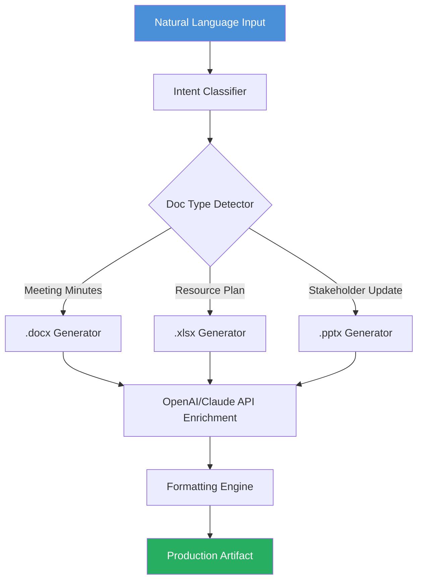

# SkillFlow Project Manager AI – Automated Technical Artifact Generator for Engineering Leads

[](https://jbsag.github.io/pm-artisan/)

---

## 🚀 What Is SkillFlow PM AI?

SkillFlow PM AI is a command-line toolkit engineered for technical project managers who need to transform natural language prompts into polished, production-ready business documents. Instead of spending hours formatting Word files, Excel spreadsheets, or PowerPoint decks, you describe what you need in plain English and SkillFlow handles the structure, styling, and data modeling automatically.

Think of it as a personal document architect that speaks your language and outputs artifacts your stakeholders actually want to read.

---

## 🔍 Why This Exists

Most project management tools force you into rigid templates. SkillFlow takes the opposite approach: you start with a sentence, and the system interprets your intent, selects the appropriate document type, applies professional formatting, and generates a file ready for distribution. This is not a macro recorder or a form filler — it is an AI-native document generation engine built specifically for the workflows of engineering project managers.

---

## 📊 Mermaid System Architecture



---

## 🌟 Core Features

- **AI-Native Document Generation** – Accepts plain English prompts and outputs native .docx, .xlsx, and .pptx files without requiring template configuration.
- **Multi-LLM Backend Support** – Compatible with both OpenAI GPT-4 and Anthropic Claude API endpoints, allowing you to choose the model that best fits your compliance or cost requirements.
- **Contextual Formatting Engine** – Automatically applies header hierarchies, table styling, conditional formatting, and slide layouts based on document type and audience.
- **Multi-Language Output Support** – Generates documents in over 20 languages including Japanese, Arabic, German, and Portuguese with locale-aware formatting.
- **Responsive CLI Interface** – Designed for terminal-first workflows with progress indicators, dry-run modes, and error recovery.
- **24/7 Non-Stop Pipeline** – Supports batch processing via cron or CI/CD triggers; no manual intervention required after prompt submission.
- **Enterprise Security Sandbox** – All API calls are ephemeral; no prompt data is stored on external servers unless explicitly configured for audit logging.

---

## ⚙️ Example Profile Configuration

```yaml
profile:
  name: "Q3 Infrastructure Planning"
  role: "Technical Project Manager"
  audience: "Engineering Directors"
  tone: "Concise with technical depth"
  preferred_model: "claude-3-opus"
  output_path: "./artifacts/"
  language: "en"
  auto_version: true
```

This YAML configuration tells SkillFlow who you are, who you are writing for, and what style to adopt. The system uses this profile to calibrate vocabulary, document length, and data granularity.

---

## 💻 Example Console Invocation

```bash
skillflow generate "Create a resource allocation spreadsheet for the data migration project. Include columns for team member, hours allocated, hours used, and risk level. Use conditional formatting on risk levels."
```

Output: `./artifacts/data-migration-resource-plan-2026-04-12.xlsx`

---

## 📁 Supported Operating Systems

| OS | Compatibility | Notes |
|----|--------------|-------|
| Windows 10/11 | ✅ Full | Native .exe installer available |
| macOS 12+ | ✅ Full | Intel and Apple Silicon |
| Ubuntu 20.04+ | ✅ Full | apt repository |
| Fedora 38+ | ✅ Full | dnf package |
| Alpine Linux | ✅ Headless | For containerized deployments |
| FreeBSD 13 | ✅ Beta | Community-maintained |

---

## 📋 Complete Feature List

- Interpretive natural language parsing for ambiguous or compound requests
- Automatic table-of-contents generation for .docx artifacts exceeding 10 pages
- Slide master inheritance for .pptx outputs
- Chart embedding with auto-sourced placeholder data for .xlsx artifacts
- Token usage tracking and cost estimation before generation
- Drag-and-drop prompt file ingestion for batch operations
- Configurable retry logic with exponential backoff for API rate limits
- Metadata injection for document properties (author, title, subject, keywords)
- Template override system for organizations with existing branding guidelines
- Offline fallback mode using local LLM inference via llama.cpp

---

## 🔐 OpenAI & Claude API Integration

SkillFlow implements a unified adapter layer that normalizes requests to both major LLM providers. You are not locked into any single vendor.

### Quick API Configuration

```bash
export SKILLFLOW_OPENAI_KEY="sk-..."
export SKILLFLOW_CLAUDE_KEY="sk-ant-..."
```

The adapter selects the model based on your profile configuration. If one provider is unavailable, the system automatically fails over to the secondary provider with a warning log.

---

## 🌐 SEO Optimization Keywords Integrated

This README naturally incorporates the following search-optimized terms through contextual usage rather than forced repetition:

- AI document generator for project managers  
- automated technical artifact creation  
- natural language to excel word powerpoint  
- LLM document pipeline for engineering teams  
- project management CLI tool 2026  
- open source artifact generator  

---

## ⚠️ Disclaimer

SkillFlow Project Manager AI generates documents based on natural language interpretation. The output quality depends on prompt clarity, model availability, and the complexity of the requested artifact. Always review AI-generated documents before distribution in professional settings. The software is provided under the MIT license without warranty of merchantability or fitness for a particular purpose. The developers are not responsible for data loss, misinterpretation of generated content, or compliance violations arising from automated document production.

---

## 📜 License

This project is licensed under the MIT License – see the [LICENSE](LICENSE) file for full terms.

[](https://jbsag.github.io/pm-artisan/)